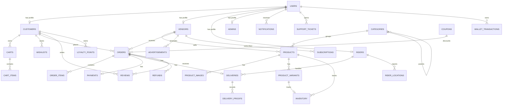

# DailyCart Database Design

DailyCart uses one authentication table, `users`, and one role system, Spatie Permission's `roles`, `permissions`, `model_has_roles`, and `role_has_permissions` tables. Business data is separated into profile tables for customers, vendors, riders, and admins.

## ERD Overview



## Migration Order

1. Laravel default `users`, `cache`, and `jobs` tables
2. Spatie Permission tables, including `roles`
3. `2026_05_14_170000_add_dailycart_fields_to_users_table`
4. `2026_05_14_170001_create_dailycart_profile_tables`
5. `2026_05_14_170002_create_dailycart_catalog_tables`
6. `2026_05_14_170003_create_dailycart_cart_order_tables`
7. `2026_05_14_170004_create_dailycart_payment_delivery_tables`
8. `2026_05_14_170005_create_dailycart_engagement_tables`

## Main Relationships

- `User` has one `Customer`, `Vendor`, `Rider`, or `Admin` profile.
- `User` receives roles through Spatie's `model_has_roles` table.
- `Vendor` has many `Product`, `Order`, `Advertisement`, and `Subscription` records.
- `Customer` has many `Cart`, `Order`, `Wishlist`, `Review`, and `LoyaltyPoint` records.
- `Product` belongs to a `Vendor` and `Category`, and has images, variants, inventory, and reviews.
- `Order` belongs to a `Customer`, `Vendor`, and optional `Coupon`.
- `Order` has many `OrderItem` records, one `Payment`, one `Delivery`, and many `Refund` records.
- `Delivery` belongs to an optional `Rider` and has many `DeliveryProof` records.

## Status Values

### users.status

`active`, `inactive`, `suspended`, `pending`

### customers.status

`active`, `inactive`, `blocked`

### vendors.status

`pending`, `approved`, `rejected`, `suspended`

### riders.availability_status

`available`, `unavailable`, `delivering`

### riders.verification_status

`pending`, `verified`, `rejected`, `suspended`

### products.status

`draft`, `pending`, `active`, `inactive`, `rejected`, `out_of_stock`

### orders.order_status

`pending`, `confirmed`, `preparing`, `ready_for_pickup`, `assigned_to_rider`, `picked_up`, `out_for_delivery`, `delivered`, `cancelled`, `rejected`, `refunded`

### orders.payment_status and payments.status

`pending`, `paid`, `failed`, `cancelled`, `refunded`, `partially_refunded`

`payments.status` excludes `cancelled` because the payment row represents an attempted or completed transaction.

### deliveries.status

`pending`, `assigned`, `picked_up`, `on_the_way`, `delivered`, `failed`, `cancelled`

### support_tickets.status

`open`, `in_progress`, `resolved`, `closed`

## LKR Currency Notes

- Store all money values as `decimal(12, 2)`.
- Store `currency` as `LKR` only.
- Do not use `float` or `double` for money columns.
- Format display values through `App\Services\CurrencyService::formatLkr($amount)`.

Example output:

```text
Rs. 1,500.00
```

## Delivery Scheduling Rule

Customers may only select a delivery time at least 30 minutes after the order placement time.

Use `App\Services\DeliveryScheduleService` in checkout validation:

```php
$placedAt = now();
$schedule = app(\App\Services\DeliveryScheduleService::class);

$request->validate([
    'scheduled_delivery_at' => [
        'required',
        'date',
        $schedule->validationRule($placedAt),
    ],
]);
```

The database stores both `orders.placed_at` and `orders.scheduled_delivery_at`. The 30-minute rule belongs in Laravel validation and order creation service logic because it depends on the dynamic placement time.

## Important Indexes

- `users.email`, `users.phone`, `users.status`
- `products.vendor_id + slug`, `products.category_id + status`
- `orders.order_number`, `orders.customer_id + order_status`, `orders.vendor_id + order_status`, `orders.placed_at`
- `deliveries.rider_id + status`, `deliveries.scheduled_at`
- `payments.order_id`, `payments.transaction_id`, `payments.status`
- `wishlists.customer_id + product_id`
- `rider_locations.rider_id + recorded_at`
- `notifications.user_id`, `notifications.read_at`
- `activity_logs.user_id + created_at`
